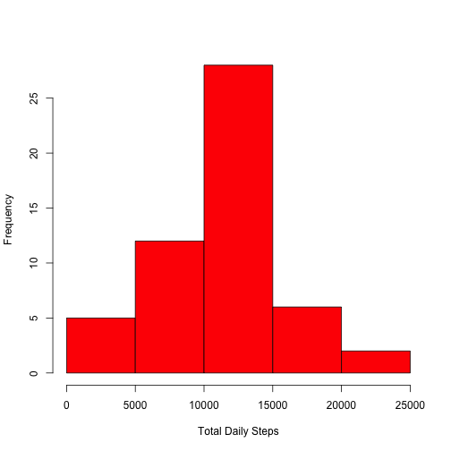
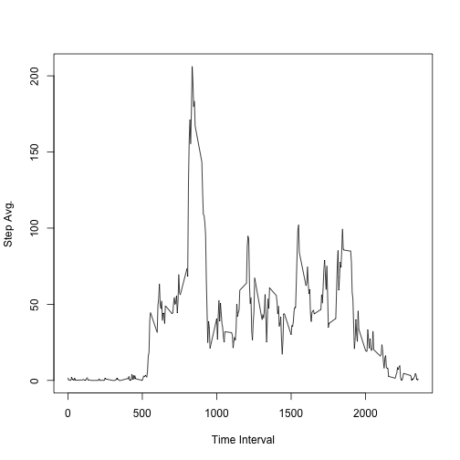
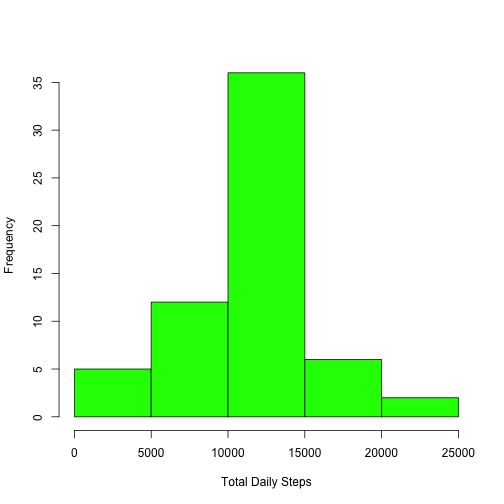
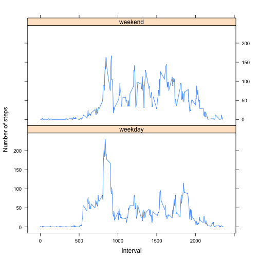

Reproducible Research - Project 1
========================================================

First the needed libraries are loaded.


```r
library(lattice)
library(reshape2)
```


## Loading and preprocessing the data

1. Load the data (i.e. `read.csv()`)

  In the following, we consider that the `"activity.csv"` file is already existing in the working directory. The original data is loaded in the `activity.data` data frame.

  
  ```r
  activity.data = read.csv("activity.csv", header = TRUE, colClasses = c("integer", 
      "Date", "integer"))
  ```


2. Process/transform the data (if necessary) into a format suitable for your analysis

  No specific preprocessing was done at this step. Other intermediate processing of the data in order to obtain the answers for the following questions is done at the respective step.

## What is mean total number of steps taken per day?

1. Make a histogram of the total number of steps taken each day

  A subset of the original data frame, not containing any `NA` value will be used at this step. It is stored in the `activity.clean` data frame.

  
  ```r
  activity.clean = na.omit(activity.data)
  hist(tapply(activity.clean$steps, activity.clean$date, sum), xlab = "Total Daily Steps", 
      main = "", col = "red")
  ```
  
   


2. Calculate and report the *mean* and *median* total number of steps taken per day

  
  ```r
  report = summary(tapply(activity.clean$steps, activity.clean$date, sum), digits = max(10, 
      getOption("digits")))
  report["Mean"]
  ```
  
  ```
  ##  Mean 
  ## 10766
  ```
  
  ```r
  report["Median"]
  ```
  
  ```
  ## Median 
  ##  10765
  ```


## What is the average daily activity pattern?

1. Make a time series plot (i.e. `type = "l"`) of the 5-minute interval (x-axis) and the average number of steps taken, averaged across all days (y-axis)

  The average number of steps, averaged accross all days, for each of the 5-minute interval is computed using the `tapply` function. The array obtained is then reshaped (melted) into a data frame (`interval.step.avg`) using the `melt` function.

  
  ```r
  interval.step.avg = tapply(activity.clean$steps, activity.clean$interval, mean)
  interval.step.avg = melt(interval.step.avg, varnames = c("interval"))
  plot(interval.step.avg, main = "", xlab = "Time Interval", ylab = "Step Avg.", 
      type = "l")
  ```
  
   


2. Which 5-minute interval, on average across all the days in the dataset, contains the maximum number of steps?

  
  ```r
  interval.step.avg[which.max(interval.step.avg$value), 1]
  ```
  
  ```
  ## [1] 835
  ```


## Imputing missing values

1. Calculate and report the total number of missing values in the dataset (i.e. the total number of rows with `NAs`)

  
  ```r
  sum(is.na(activity.data))
  ```
  
  ```
  ## [1] 2304
  ```


2. Devise a strategy for filling in all of the missing values in the dataset. The strategy does not need to be sophisticated. For example, you could use the mean/median for that day, or the mean for that 5-minute interval, etc.

  The strategy to replace the missing values consists in using for each of the 5-minute interval, the average number of steps taken, averaged over each day.
  The `merged.data` data set is created by merging over the `interval` variable the following data frames:
  - the original data frame (`activity.data`)
  - the data frame containing the average steps for each of the 5-minute interval, averaged over all the days (`interval.step.avg`)

  
  ```r
  merged.data = merge(activity.data, interval.step.avg, by.x = "interval", by.y = "interval", 
      all = TRUE)
  ```


3. Create a new dataset that is equal to the original dataset but with the missing data filled in.

  Subsequently, those lines containing `NAs` for the steps variable of the `merged.data` data frame, will have the missing values replaced by the averaged value (in column 4).

  
  ```r
  nas = is.na(merged.data$steps)
  merged.data[nas, 2] = merged.data[nas, 4]
  ```


4. Make a histogram of the total number of steps taken each day and Calculate and report the mean and median total number of steps taken per day. Do these values differ from the estimates from the first part of the assignment? What is the impact of imputing missing data on the estimates of the total daily number of steps?

  The same histogram as in Heading 2 - Question 1, only this time the `merged.data` data frame is used.

  
  ```r
  hist(tapply(merged.data$steps, merged.data$date, sum), xlab = "Total Daily Steps", 
      main = "", col = "green")
  ```
  
   
  
  ```r
  
  report = summary(tapply(merged.data$steps, merged.data$date, sum), digits = max(10, 
      getOption("digits")))
  report["Mean"]
  ```
  
  ```
  ##  Mean 
  ## 10766
  ```
  
  ```r
  report["Median"]
  ```
  
  ```
  ## Median 
  ##  10766
  ```


  The reported mean is the same as in the first part of the assignment (the case in which we ignore the `NAs`). However, the median seems to be 10 steps bigger than in the first part of the assignment. In fact, using the average steps over all days for each of the 5-minute intervals to replace the missing values is bringing the mean and the median at the same level.
  Attention: the `knittr` output is not the same as the R console output. The comments above are referring to the latter.

## Are there differences in activity patterns between weekdays and weekends?

1. Create a new factor variable in the dataset with two levels – “weekday” and “weekend” indicating whether a given date is a weekday or weekend day.

  The `day` variable will be the factor describing wheter a day is a weekday or a weekend day. It is attached to the `merged.data` data frame.

  
  ```r
  merged.data$day = as.factor(ifelse(weekdays(merged.data$date) == "Saturday" | 
      weekdays(merged.data$date) == "Sunday", "weekend", "weekday"))
  ```


2. Make a panel plot containing a time series plot (i.e. `type = "l"`) of the 5-minute interval (x-axis) and the average number of steps taken, averaged across all weekday days or weekend days (y-axis). The plot should look something like the following, which was creating using simulated data:

  In order to obtain this plot, several steps were taken:
  - the weekday and weekend data were separated into 2 different data frames (`weekday.data` and `weekend.data`)
  - for both data frames previously obtained, the average number of steps over all days, for each of the 5-minute intervals is obtained as an array and then reshaped (melted) into corresponding data frames (`weekday.step.avg` and `weekend.step.avg`)
  - the corresponding factor variable indicating the weekend / weekday is reattached to the 2 newly obtained data frames
  - the complete data frame with the average data for all days (`week.step.avg`) is obtained by binding the 2 previous data frames
  - finally, the plot between the interval and the value (`steps`) variables, conditioned over the `day` factor is drawn

  
  ```r
  weekday.data = merged.data[merged.data$day == "weekday", ]
  weekend.data = merged.data[merged.data$day == "weekend", ]
  
  weekday.step.avg = tapply(weekday.data$steps, weekday.data$interval, mean)
  weekend.step.avg = tapply(weekend.data$steps, weekend.data$interval, mean)
  weekday.step.avg = melt(weekday.step.avg, varnames = c("interval"))
  weekend.step.avg = melt(weekend.step.avg, varnames = c("interval"))
  
  weekday.step.avg$day = as.factor("weekday")
  weekend.step.avg$day = as.factor("weekend")
  
  week.step.avg = rbind(weekday.step.avg, weekend.step.avg)
  
  xyplot(value ~ interval | day, data = week.step.avg, type = "l", layout = c(1, 
      2), xlab = "Interval", ylab = "Number of steps")
  ```
  
   


